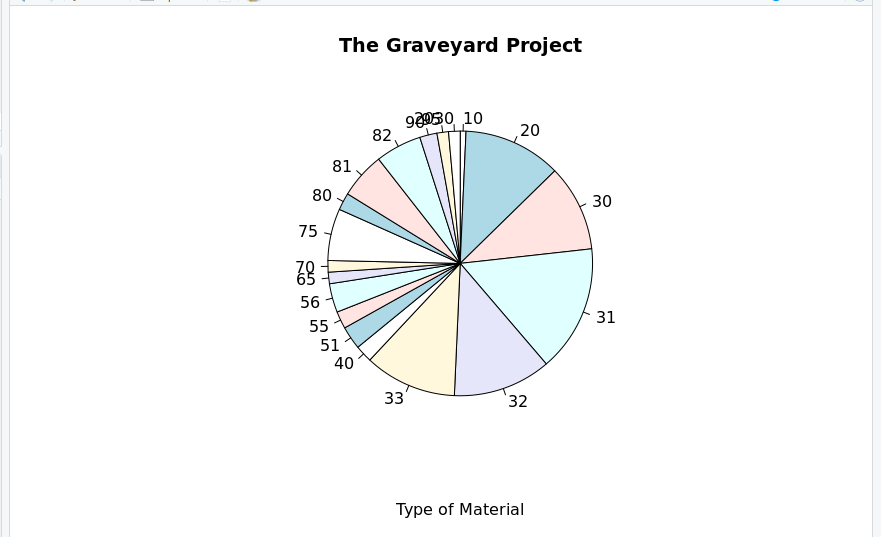
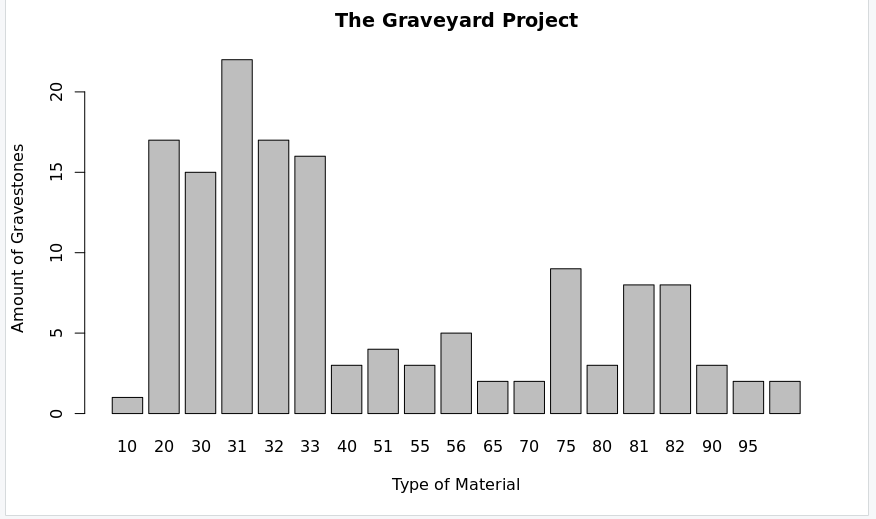

# Basic Stats in R

  No issues with R, every graphs loaded without any issues at all.   
  
  I played with the code to make my own graphs using our Graveyard Project data which you can find [here](https://github.com/Circe99/Week-Five/blob/main/R-code). 
  
  First I did two graphs for data on the denomination because I was curious to see what was most common/how many people were able to answer this one (since my answers were based on what my friend told me and he works there).  
  
  Then I decided to make the same two graphs using data for the Date of Monument  
  
  And lastly I tried Types of Quotes  
  
  I'm pretty happy with the first set, it's pretty easy to read, though it's missing some labels (which I would have to go in and add myself if I wanted to, but I decided to leave it so that you could see the original) 
  The second set turned out exactly how I expected, the pie chart was not at all a good choice for this amount of data, but the bar graph was much better because of how it shows the amount over time. I don't know how to make a graph with both the date and the denomination (but that would have been my next try if I could do it).
  The last set was similar to the first one, it worked out ok but there are clearly missing labels which is unfortunate, but an easy fix. Had my data been closer in terms of numbers it may have been harder, but luckily the numbers were pretty different. 
  
  Overall I don;t have too much to say in terms of using RStudio, it was pretty straightforward. However, I will say the data we collected it very weirdly organized/labelled/missing info, so it was hard to make graphs that made sense. I had wanted to do one on the material, but because the responces were umbers instead of words I didn't think the graph would be as easilly legible. 
   

# Databases

  

# KoBoToolbox

  
